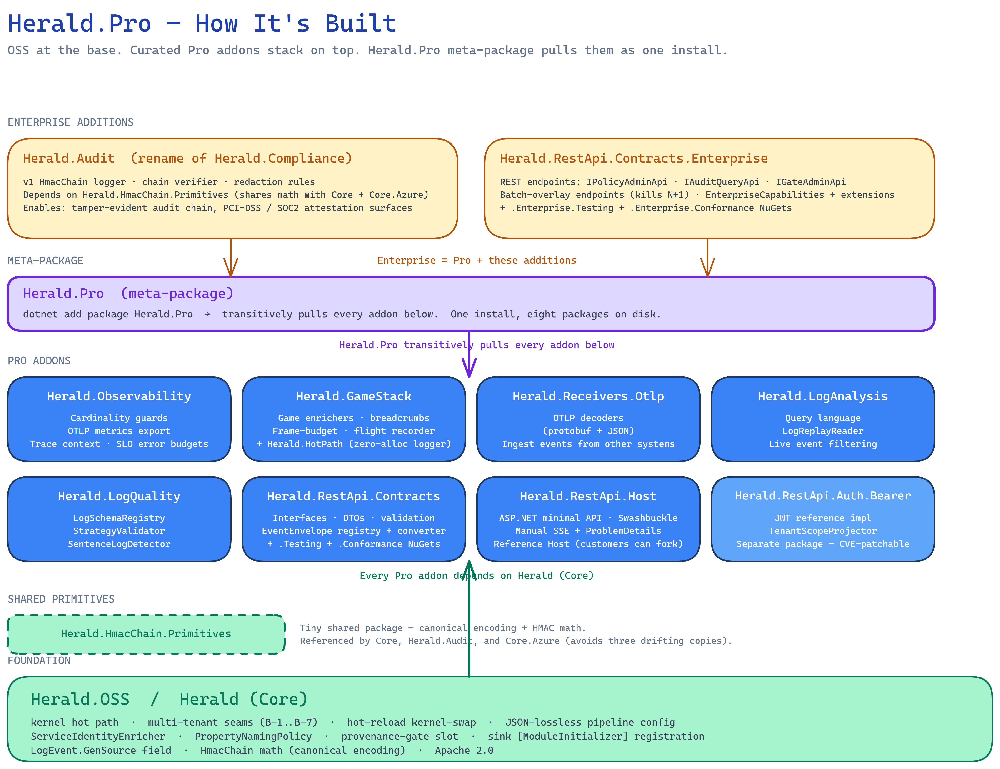

# How Herald.Pro is composed — the meta-package and the addons under it

Herald.Pro is not a separate codebase. It is a meta-package that
pulls in eight small addon packages, each one its own repo, each
one a thin layer of behavior on top of `Herald` (the Apache 2.0
Core). One `dotnet add package Herald.Pro` brings the whole Pro
edition in, and every piece is replaceable on its own schedule.

This page explains the shape: the five layers, why we chose a
meta-package over a fat package, and why a couple of addons are
deliberately split out into their own NuGets.

## The five layers, bottom-up

The architecture stacks like this:

> Source: [pro-composition.excalidraw](../../../diagrams/core/pro-composition.excalidraw).
> Open at [excalidraw.com](https://excalidraw.com) to edit. This
> diagram is a planning artifact today. It will be re-authored as a
> hand-authored SVG when the addon repos ship.

### Layer 1 — Foundation: Herald.OSS (Core)

The bottom layer is `Herald`, the Apache 2.0 Core. Every other
layer depends on it. The kernel and chain paths live here. So do
the multi-tenant seams, the hot-reload contract, the JSON-lossless
config, the property naming policy, the sink module-initializer
registration, the `LogEvent.GenSource` field, and the canonical
HmacChain math. The provenance gate has a slot here too, but the
enforcement lives in Enterprise.

The companion page on
[the kernel fast path](../../herald-oss/explanation/kernel-vs-chain.md)
covers the runtime shape Core ships.

### Layer 2 — Shared primitives: Herald.HmacChain.Primitives

A tiny package, on purpose. Three packages need the HmacChain
encoding: Core itself, `Herald.Audit` (the Enterprise chain
logger), and `Core.Azure` (the cloud build of Core). Without a
shared primitives package, the math would live in three places and
slowly drift.

> **Quick picture.** Imagine three bakeries in a town, all serving
> the same signature loaf. If each bakery writes its own recipe
> card, the recipes drift. One bumps the salt. One switches to
> bread flour. One shaves a minute off the bake. After a year, the
> three "same" loaves taste different. The fix is one printed
> recipe card that every bakery uses. `HmacChain.Primitives` is the
> recipe card. The encoding is identical in every consumer because
> there is only one copy of the code.

That is the textbook DRY motivation. We could have copy-pasted the
math three times and called it "small enough." The cost of that
choice would show up two years from now, when one copy fixed a
constant-time-compare regression and the other two didn't. The
primitives package is cheap to publish, cheap to depend on, and
removes the drift surface entirely.

### Layer 3 — Pro addons (eight packages, each its own repo)

The Pro edition is eight addon packages, each one a small focused
behavior:

- **`Herald.Observability`** — OpenTelemetry counters/histograms,
  the CardinalityGuardProcessor, structured-noise reductions.
- **`Herald.GameStack`** — gameplay-tier ergonomics. Ships two
  csproj files in one repo: `GameStack` (the public surface) and
  `HotPath` (per-frame helpers that need their own tight surface).
- **`Herald.Receivers.Otlp`** — receive side. Accept OTLP from an
  upstream collector and feed it into a Herald pipeline.
- **`Herald.LogAnalysis`** — post-hoc analysis: cardinality reports,
  template hot-spots, drift detection across a captured event
  stream.
- **`Herald.LogQuality`** — pre-flight quality gates: lint rules
  for templates and properties, ready to wire into CI.
- **`Herald.RestApi.Contracts`** — the REST surface contracts. Ships
  alongside `.Testing` (test doubles) and `.Conformance` (a NuGet
  that runs the conformance suite against any implementation).
- **`Herald.RestApi.Host`** — a reference ASP.NET Core host that
  implements the contracts.
- **`Herald.RestApi.Auth.Bearer`** — JWT bearer auth handler for
  the host. Separate package on purpose.

The REST family is shipped. The other five addons + `HmacChain.Primitives`
+ the meta-package itself are locked design, not yet built.

### Layer 4 — The meta-package: Herald.Pro

`Herald.Pro` has no code of its own. It is a NuGet package whose
only job is to declare a transitive dependency on every addon in
Layer 3. When a consumer runs `dotnet add package Herald.Pro`, all
eight addons land in the project at compatible versions.

> **Quick picture.** Think of a season ticket to a concert series.
> The ticket itself is just a piece of cardstock. It doesn't play
> any music. What it does is admit you to twelve concerts on twelve
> nights. `Herald.Pro` is the season ticket. The concerts are the
> eight addons.

This is the *Composable* property of CUPID showing up in the
package layout. A consumer who needs every Pro behavior takes the
meta-package and is done. A consumer who only needs two addons can
skip the meta-package and reference those two directly. Both paths
are valid; the meta-package is convenience, not a wall.

### Layer 5 — Enterprise additions

Two packages extend the Pro stack into Enterprise:

- **`Herald.Audit`** — the v1 HmacChain logger, the verifier, and
  the redaction stack. (This is the rename of the package formerly
  called `Herald.Compliance`.) It depends on Core directly, and
  pulls `HmacChain.Primitives` for the shared encoding.
- **`Herald.RestApi.Contracts.Enterprise`** — the policy admin,
  audit query, and gate admin REST endpoints. Uses the batch-overlay
  pattern over the Pro REST contracts. Ships its own
  `.Enterprise.Testing` and `.Enterprise.Conformance` NuGets, the
  same way the Pro REST family does.

Enterprise customers take Pro plus these two. They don't take a
separate Enterprise meta-package today because two addons isn't
enough to earn one.

## Why a meta-package, not a fat package

The natural alternative would have been one big `Herald.Pro`
package that bundles every addon's code into a single NuGet. We
chose against it for two practical reasons and one principled one.

**Practical 1: independent release cadence.** Each addon ships on
its own schedule. `Herald.Observability` may need a fast patch for
a new OpenTelemetry version. `Herald.LogQuality` may add a lint
rule on a quiet week. A fat package would force every addon to
ride the same release train, which means every patch becomes a
coordination problem.

**Practical 2: small projects don't pay for what they don't use.**
A consumer who only wants OTLP receive doesn't need to pull
GameStack's helpers, LogAnalysis's analyzers, or the REST host. A
fat package would put all of that on disk in every install. A
meta-package lets the consumer take only what they need by
referencing addons directly.

**Principled: the addon boundary is where reuse lives.** Each addon
is a coherent behavior. Bundling them into one package would erase
the seams that make them individually reusable. That is the
*Composable* property of CUPID at work. Small pieces, each one
useful on its own, that combine into bigger pictures. A fat package
would be *Domain-based* (it would carry the Pro brand) at the cost
of *Composable* (each behavior could no longer travel on its own).
The meta-package keeps both.

## Why Auth.Bearer is its own package

`Herald.RestApi.Auth.Bearer` could have been a folder inside
`Herald.RestApi.Host`. We split it out because auth code attracts
CVEs, and the patch shape matters.

> **Quick picture.** Imagine your house has a smoke detector in
> every room. When the kitchen one starts beeping, you want to
> replace just that one. You don't want to rewire the whole
> electrical panel. Auth code is the smoke detector. If a JWT-handler
> CVE drops, we want to ship a patched `Herald.RestApi.Auth.Bearer`
> and have consumers update one package. Bundling it into the Host
> package would mean a CVE patch ships as a Host release, which
> forces a Host upgrade for unrelated reasons.

The package boundary is also where alternative auth handlers can
live. A consumer who wants mTLS or API-key auth writes their own
`Herald.RestApi.Auth.MyScheme` package and references it instead.
That option doesn't exist if auth is welded into the Host.

This is the *Unix philosophy* property of CUPID: one package, one
job. The Host hosts. The Auth package authenticates. The line is
sharp because the failure modes are different.

## Why each addon is its own repo

The repo boundary matches the package boundary. Each addon's repo
holds the code, the tests, the docs, the CI, and the release
process for that one addon. Issues live where the code lives. PRs
land where the addon's reviewer is paying attention.

This is the cost of buying *Composable*. The benefit is that any
addon can be lifted, replaced, deprecated, or open-sourced
independently. A future change that opens `Herald.LogQuality` to
the community is a one-repo decision. A change that retires
`Herald.GameStack` after gaming customers move on doesn't touch
the other seven.

The cost is real. Nine repos take more operational care than one
monorepo would. We pay it because the alternative is a fat repo
that locks every addon to the same lifecycle. That is the same
*Composable*-versus-convenience tradeoff in source form rather than
package form.

## What this is not

A few framings this page is not making, because the line matters.

- This is not a separate codebase. Herald.Pro reuses every line
  of Herald (Core) at the API level. There is no fork.
- This is not feature gating inside Core. Core ships everything
  it ships under Apache 2.0. The Pro addons add new behaviors;
  they don't unlock dormant Core behaviors.
- This is not a multi-tier license maze. Two paid SKUs (Pro,
  Enterprise) wrap the OSS Core. The composition above shows what
  the two SKUs include.
- This is not the final visual. The Excalidraw source above is a
  planning sketch. When the addon repos ship, this page's diagram
  will be re-authored as a hand-authored SVG matching the
  herald-website architecture-page style.

## See also

- [The kernel fast path](../../herald-oss/explanation/kernel-vs-chain.md)
  — what Core ships at the runtime level that every Pro addon
  builds on.
- The REST API family is the first Pro addon shipped (206/206
  tests, Phases 1-4 complete in `Herald.RestApi`). It is the
  reference example for how a Pro addon ships its
  `.Testing` / `.Conformance` NuGets.
