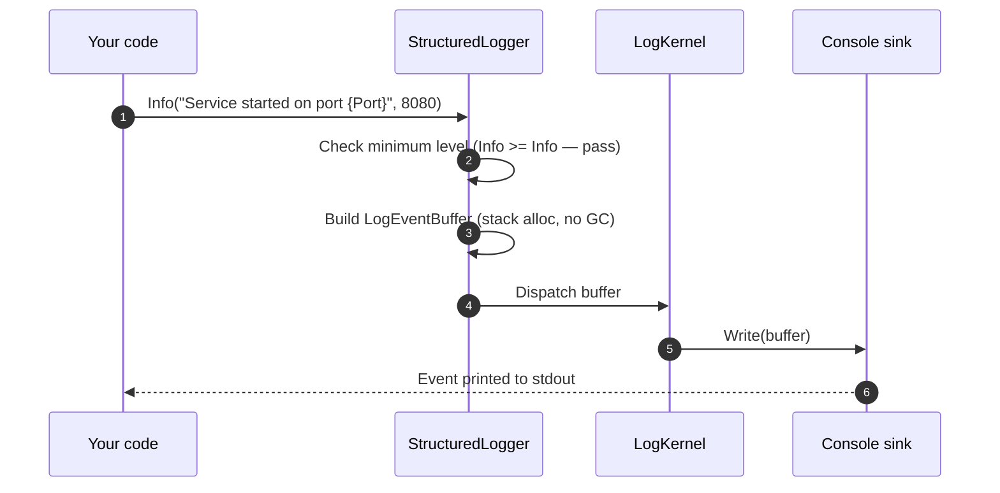

# Your first Herald.OSS pipeline

This tutorial walks you from an empty folder to a running logger
that prints structured events to your console. You will write
three lines of code and run two `dotnet` commands. It should take
about ten minutes.

By the end you will have a working pipeline and a clear picture of
what happens when you call `logger.Info(...)`. The picture matters
more than the code — once you have it, everything else in
Herald.OSS sits in the same shape.

## Before you start

You need:

- .NET 8 SDK or newer
- A terminal
- A text editor or IDE that knows C#

You do not need anything else. No package feed, no hosting, no
config file.

## Step 1 — Make a new project

In an empty folder:

```bash
dotnet new console -n HeraldHello
cd HeraldHello
```

## Step 2 — Add Herald.OSS

```bash
dotnet add package Herald.OSS
```

This brings in the logger, the source generators, and the built-in
console sink. One package.

## Step 3 — Write the smallest useful pipeline

Open `Program.cs` and replace its contents with:

```csharp
using MMP.Herald;
using MMP.Herald.Quick;

var result = QuickLogBuilder
    .Create()
    .WithConsoleSink()
    .Build();

var logger = result.Logger;

logger.Info(LogCategory.App, "Service started on port {Port}", 8080);
logger.Warn(LogCategory.App, "Slow request: {DurationMs} ms", 412);
```

Three things are happening here.

1. `QuickLogBuilder.Create()` opens a builder with safe defaults.
2. `.WithConsoleSink()` adds one sink — the console — to the
   pipeline.
3. `.Build()` validates the configuration, compiles the kernel,
   and hands back a `QuickLogResult` whose `.Logger` property is
   what you call.

## Step 4 — Run it

```bash
dotnet run
```

You should see two events on the console. Each event shows the
level, the timestamp, the rendered message, and the structured
properties — `Port=8080` for the first event, `DurationMs=412` for
the second.

## What just happened

Here is the path your `logger.Info(...)` call took.



A few things to notice about this picture.

- The minimum-level check runs first. If the call was below the
  floor, the path stops at step 2. Nothing is built, nothing is
  dispatched.
- The `LogEventBuffer` is a stack-allocated value. The accept path
  does not allocate on the heap. That is what "zero-allocation
  logging" means in practice.
- The kernel hands the buffer to the sink directly. There is no
  decorator chain in this pipeline — you didn't ask for one, so
  you don't pay for one.

> **Quick picture.** Think of the call path like a fire-station
> alarm system. The dispatcher answers the call (level check),
> writes the address on a card (the buffer), and hands it to the
> truck (the sink). The card stays on the dispatcher's desk while
> the truck reads it; nothing about the card needs to live on
> after the truck rolls out. That "card on the desk" is what
> stack-allocation does for the event.

## One common pitfall

If you call `logger.Verbose(...)` instead of `logger.Info(...)`,
you will see no output. That is by design — the default minimum
level is `Info`. Verbose and Debug events are filtered out at the
accept-path level check.

To see lower-level events, set the floor when you build:

```csharp
var result = QuickLogBuilder
    .Create()
    .WithMinimumLevel(LogLevel.Verbose)
    .WithConsoleSink()
    .Build();
```

Now `Verbose` and `Debug` events make it through.

This is a CUPID-shaped choice. *Predictable* says the default
behavior should be the one you can reason about without reading
the docs. Most apps in production sit at `Info` or above; the
default matches that. You opt down to `Verbose` only when you have
a reason — which keeps the hot path lean for everyone who didn't.

The same principle, by the way, is why we don't ship two builders
called `VerboseLogBuilder` and `InfoLogBuilder`. That would be a
DRY violation dressed up as ergonomics. One builder, one knob, one
default.

## What to read next

- [The kernel fast path](../explanation/kernel-vs-chain.md) —
  explains the path your event took in more detail. Especially
  worth reading if your service is latency-sensitive.
- The JSON-configured tutorial (coming in the next wave) shows
  how to drive the same pipeline from `herald.json` so operators
  can change levels without a rebuild.
