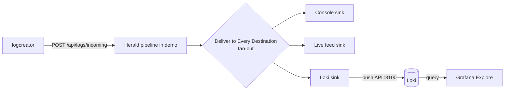

# Project 5, Ship the logs to production

The demo shows logs in your browser. That is great for seeing the
pipeline work. Production needs the logs somewhere durable, searchable,
and shared. This project sends the demo's logs to **Grafana Loki**, a
log store you query through **Grafana**, both running in Docker on your
own machine.

You do not build the Docker setup from scratch. Herald already ships a
working Loki + Grafana stack at
`Modules/Herald.Sci/samples/loki-stack`. You reuse it and point the demo
at its Loki.

By the end you will:

1. Stand up the existing loki-stack with one `docker compose up`.
2. Add the Herald **Loki sink** to the demo and point it at that Loki.
3. Set the sink live and send traffic.
4. Open Grafana, run a query, and see the Herald logs land.

> **Scaffold note.** This page is a draft. The Docker setup is the real,
> committed loki-stack, so step 1 works today. The sink-wiring steps are
> the planned shape and are **not yet walk-verified**. Two real gaps have
> to close before the logs actually land in Grafana. Read the two
> [forcing-function findings](#forcing-function-findings) at the end
> before you expect steps 3 and 4 to work.

> **Quick picture.** Loki is a warehouse for log lines. It does not read
> every word of every box. It files each box by a few labels on the
> outside (which app, which level, which environment) and keeps the
> contents packed inside. When you search, you pick boxes by their labels
> first, then look inside the few that match. That is why Loki stays fast
> and cheap: a small label index over big compressed contents.

---

## Step 1, Stand up the loki-stack

You need Docker Desktop running. The stack is already in the repo. From
the Herald checkout:

```bash
cd Modules/Herald.Sci/samples/loki-stack
docker compose up -d
```

That brings up three containers:

- **Loki** on `:3100`. Accepts log pushes and answers queries.
- **Grafana** on `:3000`. Pre-provisioned with the Loki datasource, so
  Explore works the moment it loads. Login is `admin` / `admin`.
- **A renderer sidecar.** Headless Chrome for Grafana's `/render` API.
  The validate script uses it to snapshot dashboards. You can ignore it
  for this project.

The datasource is auto-provisioned (`grafana-datasources/loki.yaml`) with
a stable UID, so you never click through datasource setup.

**What you should see.** All three containers report healthy. Open
Grafana at `http://localhost:3000` and log in. Go to **Connections →
Data sources** and confirm **Loki** is listed and marked default. Loki
itself answers at `http://localhost:3100`. You can check that
`http://localhost:3100/ready` returns `ready`.

The stack ships a validate script that confirms all three services are
reachable and Grafana can reach Loki:

```bash
bash validate.sh
```

At this point Grafana and Loki are up and talking. No DemoApp logs have
arrived yet. That is the next step.

> **What the stack already expects.** The bundled dashboard
> ("Herald.Sci Sample, Live Events") is wired to the
> `{job="herald-sci-sample"}` stream that a *different* sample pushes.
> The DemoApp's Loki sink does not use that label. For this project you
> work in Grafana's **Explore** tab and query by the labels the Loki
> sink actually sets. See
> [forcing-function finding 2](#finding-2-the-bundled-dashboard-binds-to-the-wrong-label).

---

## Step 2, Add the Loki sink to the demo

> **Provisional and blocked.** These steps are the planned operator flow.
> They depend on the demo being able to emit through a Loki sink, which
> is [finding 1](#finding-1-the-loki-sink-emit-path-is-not-wired). Read
> that first.

The demo knows about every Herald sink, including Loki, even before you
install it. Adding a sink is two separate jobs, and the demo keeps them
separate on purpose:

- **Download** pulls the sink's package so the demo can run it.
- **Use** configures the sink and adds it to the pipeline.

One does not do the other. You can download a sink and never wire it in.

**Step outline (provisional).**

1. Open the Pipeline page. Open the sink catalog (the Available Sinks
   panel). Find **Loki**, kind `loki`, package `Herald.Sinks.Loki`.
2. **Download it.** Click download. The package pulls from NuGet and Loki
   moves from *advertised* to *installed*.
3. **Add it.** Add the installed Loki sink to the pipeline. It starts in
   **TEST** state: present and configurable, but not yet emitting.
4. **Configure it.** Open the sink's config. Set the one required field:
   - **Push endpoint.** `http://localhost:3100`. The sink appends
     `/loki/api/v1/push` for you.
   - **Bearer token.** Leave blank. Your local Loki needs no auth.
5. **Set it live.** Flip the sink from TEST to Live. This is a hot-swap:
   the pipeline brings the sink up with your config, no restart.

> **Config note: what the demo can set, and what it cannot.** The Loki
> sink's JSON config exposes exactly two fields: the push endpoint and an
> optional bearer token. Static labels (like `app` or `env`) and
> basic-auth credentials exist on the sink, but they are set in code at
> construction, not through the demo's config form. That is deliberate.
> Promoting the wrong field to a Loki label can explode Loki's index, so
> the label decision is kept out of casual config editing. For the demo,
> the endpoint is all you need. The sink labels each event by its level
> and category automatically.

---

## Step 3, Send traffic and watch it land in Grafana

1. Make sure the Loki sink is live and the fan-out (Deliver to Every
   Destination) is on, so the pipeline feeds console, the live feed, and
   Loki all at once.
2. Send a steady stream from `logcreator`:
   ```bash
   logcreator --out http://localhost:5210/api/logs/incoming --rate 10
   ```
3. In Grafana, open **Explore** (the compass icon). Pick the **Loki**
   datasource.
4. Run a query. The Loki sink labels each event by `level` and
   `category`, so query on those. Start with everything that has a
   category:
   ```logql
   {category=~".+"}
   ```
   Then narrow by level:
   ```logql
   {level="error"}
   ```
5. **What you should see.** Log lines appear in Grafana, matching the
   events scrolling in the demo's live feed. Each line is structured
   JSON. Expand one and you see the message, the template, and the
   event's properties. Add `| json` to the query to pull fields out:
   ```logql
   {level="error"} | json
   ```

That is the whole loop. The same event you watched in the browser is now
queryable in Grafana, delivered by a real Herald sink over the real Loki
push API.

Here is the full path one event takes once the Loki sink is live:



One event, three destinations. The console and the live feed are what
you watched all guide. The Loki sink is the new one. It carries the same
event to your Docker Loki, where Grafana reads it back.

---

## Clean up

```bash
cd Modules/Herald.Sci/samples/loki-stack
docker compose down          # stop the containers
```

The stack stores Loki data under `./loki-data`, so events survive a
restart. Delete that folder if you want a clean slate.

---

## Forcing-function findings

Two pieces have to be built before steps 3 and 4 actually work. Both are
the same class of gap the ingest path had: the surface is ready, but a
wire in the middle is missing. Neither is a problem with the loki-stack
or the Loki sink package themselves. They are integration seams in the
DemoApp.

### Finding 1, the Loki sink emit path is not wired

**What works today.** The demo's sink catalog already knows about Loki.
The contract for download, add, configure, and set-live is defined. The
`Herald.Sinks.Loki` package is complete: `LokiLogSink` posts to the Loki
push API, and `LokiLogSinkProvider` builds the sink from a config that
carries an `endpoint`.

**Where it breaks.** When the demo turns a live sink into an actual
pipeline sink, it runs a dispatch on the sink's kind. That dispatch lives
in `PipelineBootstrapToBuilder.ApplyOneSink`. Today it has cases for
`console`, `http_json`, `json_file`, `text_file`, and `otlp`, and nothing
else. A sink with kind `loki` falls to the default branch, which records
it as *unmapped*, degrades it to *unavailable*, and keeps going. The
pipeline never instantiates `LokiLogSink`. Nothing is pushed to Loki.

So an operator can download Loki, configure it, and set it live, and the
demo will honestly show it as *unavailable* rather than emitting, because
the host has no wire from the `loki` kind to the provider.

**What needs to happen (for Jared and Richard).** Two things, and they
mirror what the ingest path needed:

1. **Register the Loki provider in the demo host** when the bootstrap
   wires a live `loki` sink. Use the same on-demand, per-builder
   registration pattern `TryRegisterHttpJsonProvider` already uses for
   `http_json`. Registering on demand keeps a Loki-less pipeline from
   dragging in the Loki assembly.
2. **Add a `loki` case to `ApplyOneSink`** that reads the `endpoint` (and
   optional `bearer_token`) from the sink's config and calls the builder
   to wire `LokiLogSink` through its provider. This is the data-plane wire
   the control plane is already promising.

The cleaner long-term shape is a generic provider lookup keyed on the sink
kind, so adding the 80-plus catalog sinks does not mean 80-plus
hand-written switch cases. That is an architecture call for Richard. The
switch is fine for the handful of demo-built sinks, but `loki` is the
second outside-network sink (after `otlp`) and a good forcing function to
decide whether the switch grows or gets replaced by a registry.

### Finding 2, the bundled dashboard binds to the wrong label

**What works today.** The loki-stack ships a ready Grafana dashboard,
"Herald.Sci Sample, Live Events." It is provisioned and binds to the
`{job="herald-sci-sample"}` stream.

**Where it breaks.** That `job` label comes from the Herald.Sci
instrument-host sample, not from the Loki sink the DemoApp uses. The Loki
sink labels each event by `level` and `category` only (see
`LokiLogSink.BuildLabelsForEvent`). There is no `job` label on DemoApp
traffic, so the bundled dashboard stays empty even when DemoApp logs are
landing in Loki. The Explore queries in step 3 work, because they query
the labels the sink actually sets. The pre-built dashboard does not.

**What needs to happen.** Two options, smallest first:

1. **Document Explore only** (this page does that today). The reader uses
   the Explore tab with `{level=...}` / `{category=...}` queries and never
   touches the bundled dashboard. No code change. Lowest effort.
2. **Ship a DemoApp-specific dashboard** that binds to `{level=~".+"}` or
   adds a static `app="herald-demo"` label so a dashboard can target it.
   The static-label route needs the Loki sink to set an `app` label,
   which today is construction-only and not surfaced through config. That
   is a small DemoApp host change (set a static label when it builds the
   sink), not a Loki sink change.

This is lower-stakes than finding 1. The demo is usable with Explore-only.
The dashboard is a polish item.

**Files involved.**

- `E:\dev\Herald.RestApi.FakeServer\src\Herald.RestApi.FakeServer\Demo\PipelineBootstrapToBuilder.cs`
  holds the `ApplyOneSink` switch and the `TryRegisterHttpJsonProvider`
  pattern to mirror (finding 1).
- `E:\dev\Herald\Modules\Herald.Sinks\src\Herald.Sinks.Loki\Providers\LokiLogSinkProvider.cs`
  is the provider to register. It is already complete (finding 1).
- `E:\dev\Herald\Modules\Herald.Sinks\src\Herald.Sinks.Loki\LokiLogSink.cs`
  `BuildLabelsForEvent` is where the `level` / `category` labels are set
  (finding 2).
- `E:\dev\Herald\Modules\Herald.Sci\samples\loki-stack\grafana-dashboards\herald-sci-sample.json`
  is the bundled dashboard bound to `job=herald-sci-sample` (finding 2).

Until finding 1 lands, Project 5 stops at Step 2. You can stand up the
loki-stack, and you can add and configure the Loki sink in the demo, but
it will read as *unavailable* and no logs reach Grafana.
