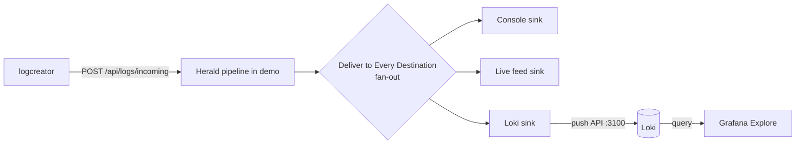

# Project 5, Ship the logs to production

The demo shows logs in your browser. That is great for seeing the
pipeline work. Production needs the logs somewhere durable, searchable,
and shared. This project sends the demo's logs to **Grafana Loki**, a
log store you query through **Grafana**, both running in Docker on your
own machine.

You do not build the Docker setup from scratch. Herald already ships a
working Loki + Grafana stack at
`Modules/Herald.Sci/samples/loki-stack`. You reuse it and point the demo
at its Loki.

By the end you will:

1. Stand up the existing loki-stack with one `docker compose up`.
2. Add the Herald **Loki sink** to the demo and point it at that Loki.
3. Set the sink live and send traffic.
4. Open Grafana, run a query, and see the Herald logs land.

> **What the walk verified, and what needs Docker.** The sink path is
> walk-verified: you can download the Loki sink, configure it, set it
> Live, and watch the demo register it with health staying healthy. The
> last step, seeing the logs in Grafana, needs the loki-stack running
> under Docker. That step works for a human operator with Docker up; it
> is just Docker-dependent, so it sits outside the headless walk. One
> known gap remains on the Grafana side: the bundled dashboard binds to
> the wrong label, so you query through Grafana's Explore tab instead.
> See [the known dashboard-label gap](#known-gap-the-bundled-dashboard-binds-to-the-wrong-label).

> **Quick picture.** Loki is a warehouse for log lines. It does not read
> every word of every box. It files each box by a few labels on the
> outside (which app, which level, which environment) and keeps the
> contents packed inside. When you search, you pick boxes by their labels
> first, then look inside the few that match. That is why Loki stays fast
> and cheap: a small label index over big compressed contents.

---

## Step 1, Stand up the loki-stack

You need Docker Desktop running. The stack is already in the repo. From
the Herald checkout:

```bash
cd Modules/Herald.Sci/samples/loki-stack
docker compose up -d
```

That brings up three containers:

- **Loki** on `:3100`. Accepts log pushes and answers queries.
- **Grafana** on `:3000`. Pre-provisioned with the Loki datasource, so
  Explore works the moment it loads. Login is `admin` / `admin`.
- **A renderer sidecar.** Headless Chrome for Grafana's `/render` API.
  The validate script uses it to snapshot dashboards. You can ignore it
  for this project.

The datasource is auto-provisioned (`grafana-datasources/loki.yaml`) with
a stable UID, so you never click through datasource setup.

**What you should see.** All three containers report healthy. Open
Grafana at `http://localhost:3000` and log in. Go to **Connections →
Data sources** and confirm **Loki** is listed and marked default. Loki
itself answers at `http://localhost:3100`. You can check that
`http://localhost:3100/ready` returns `ready`.

The stack ships a validate script that confirms all three services are
reachable and Grafana can reach Loki:

```bash
bash validate.sh
```

At this point Grafana and Loki are up and talking. No DemoApp logs have
arrived yet. That is the next step.

> **What the stack already expects.** The bundled dashboard
> ("Herald.Sci Sample, Live Events") is wired to the
> `{job="herald-sci-sample"}` stream that a *different* sample pushes.
> The DemoApp's Loki sink does not use that label. For this project you
> work in Grafana's **Explore** tab and query by the labels the Loki
> sink actually sets. See
> [the known dashboard-label gap](#known-gap-the-bundled-dashboard-binds-to-the-wrong-label).

---

## Step 2, Add the Loki sink to the demo

The demo knows about every Herald sink, including Loki, even before you
install it. Adding a sink is two separate jobs, and the demo keeps them
separate on purpose:

- **Download** pulls the sink's package so the demo can run it.
- **Use** configures the sink and adds it to the pipeline.

One does not do the other. You can download a sink and never wire it in.

**Steps (walk-verified).**

1. Open the Pipeline page. Open the sink catalog (the Available Sinks
   panel). Find **Loki**, kind `loki`, package `Herald.Sinks.Loki`.
2. **Download it.** Click download. The package pulls from NuGet and Loki
   moves from *advertised* to *installed*.
3. **Add it.** Add the installed Loki sink to the pipeline. It starts in
   **TEST** state: present and configurable, but not yet emitting.
4. **Configure it.** Open the sink's config. Set the one required field:
   - **Push endpoint.** `http://localhost:3100`. The sink appends
     `/loki/api/v1/push` for you.
   - **Bearer token.** Leave blank. Your local Loki needs no auth. (The
     token field is a documented follow-up. The demo's network-sink
     config has no token slot today. That is fine here, since the local
     loki-stack needs no auth.)
5. **Set it live.** Flip the sink from TEST to Live. The demo wires the
   Loki provider on demand, brings the sink up with your endpoint, and
   reports it healthy. No restart. On the walk, the sink reaches Live and
   health stays healthy.

> **How the demo knows how to wire Loki.** The demo dispatches each sink
> by its kind through a registry, not a hand-written switch. A `loki`
> entry resolves to the Loki provider, and the provider is registered
> only when a live `loki` sink is actually present, so a console-only
> pipeline never drags in the Loki assembly. Adding the next sink is one
> table entry, not a new branch.
>
> This is CUPID's *Composable* property doing real work: the sink catalog
> and the live pipeline share one kind-keyed seam, so a new sink slots in
> without touching the dispatch logic. If a sink's package is missing, the
> demo degrades that one sink to *unavailable* and keeps the rest of the
> pipeline running. It does not fault the whole build.

> **Config note: what the demo can set, and what it cannot.** The Loki
> sink's JSON config exposes exactly two fields: the push endpoint and an
> optional bearer token. Static labels (like `app` or `env`) and
> basic-auth credentials exist on the sink, but they are set in code at
> construction, not through the demo's config form. That is deliberate.
> Promoting the wrong field to a Loki label can explode Loki's index, so
> the label decision is kept out of casual config editing. For the demo,
> the endpoint is all you need. The sink labels each event by its level
> and category automatically.

---

## Step 3, Send traffic and watch it land in Grafana

> **This step needs Docker.** Steps 1 and 2 stand on their own. The
> loki-stack is up and the Loki sink is Live and healthy. This step is
> the visualization payoff, and it needs the loki-stack containers
> running (Step 1) so Grafana has something to read. It works for an
> operator with Docker up. It is the one Docker-dependent step on this
> page.

1. Make sure the Loki sink is live and the fan-out (Deliver to Every
   Destination) is on, so the pipeline feeds console, the live feed, and
   Loki all at once.
2. Send a steady stream from `logcreator`:
   ```bash
   logcreator --out http://localhost:5210/api/logs/incoming --rate 10
   ```
3. In Grafana, open **Explore** (the compass icon). Pick the **Loki**
   datasource.
4. Run a query. The Loki sink labels each event by `level` and
   `category`, so query on those. Start with everything that has a
   category:
   ```logql
   {category=~".+"}
   ```
   Then narrow by level:
   ```logql
   {level="error"}
   ```
5. **What you should see.** Log lines appear in Grafana, matching the
   events scrolling in the demo's live feed. Each line is structured
   JSON. Expand one and you see the message, the template, and the
   event's properties. Add `| json` to the query to pull fields out:
   ```logql
   {level="error"} | json
   ```

That is the whole loop. The same event you watched in the browser is now
queryable in Grafana, delivered by a real Herald sink over the real Loki
push API.

Here is the full path one event takes once the Loki sink is live:



One event, three destinations. The console and the live feed are what
you watched all along. The Loki sink is the new one. It carries the same
event to your Docker Loki, where Grafana reads it back.

---

## Clean up

```bash
cd Modules/Herald.Sci/samples/loki-stack
docker compose down          # stop the containers
```

The stack stores Loki data under `./loki-data`, so events survive a
restart. Delete that folder if you want a clean slate.

---

## What changed since the scaffold

An earlier draft of this page flagged the Loki sink as *not wired*: it
said a `loki` sink would fall to a default branch and degrade to
*unavailable* instead of emitting. That is no longer true, and the walk
confirms it.

The demo now dispatches sinks through a kind-keyed registry
(`SinkKindRegistry`), not a hand-written switch. The `loki` kind resolves
to `LokiLogSinkProvider`, the provider registers on demand when a live
`loki` sink is present, and the sink wires through `WithNetworkSink` to
push at `{endpoint}/loki/api/v1/push`. On the walk, the Loki sink reaches
Live and health stays healthy. The emit path is real.

So Project 5's sink steps (download, add, configure, set Live) are
walk-verified. What remains is the Grafana side, and it is one known gap,
not a blocker.

---

## Known gap, the bundled dashboard binds to the wrong label

**What works.** The loki-stack ships a ready Grafana dashboard,
"Herald.Sci Sample, Live Events." It is provisioned and binds to the
`{job="herald-sci-sample"}` stream.

**Where it falls short.** That `job` label comes from the Herald.Sci
instrument-host sample, not from the Loki sink the DemoApp uses. The Loki
sink labels each event by `level` and `category` only (see
`LokiLogSink.BuildLabelsForEvent`). There is no `job` label on DemoApp
traffic, so the bundled dashboard stays empty even when DemoApp logs are
landing in Loki.

**What you do about it.** Use Grafana's **Explore** tab and query the
labels the sink actually sets: `{level=...}` and `{category=...}`. That
is what Step 3 shows, and it works. The pre-built dashboard stays empty;
ignore it for this project. There is no code change you need to make.

If you later want a dashboard that lights up for DemoApp traffic, the
DemoApp host can set a static `app="herald-demo"` label so a dashboard can
target it. That is a small host change, not a Loki sink change. The sink
already does its job. It is a polish item, tracked for later.

**Files involved (for the polish item).**

- `E:\dev\Herald\Modules\Herald.Sinks\src\Herald.Sinks.Loki\LokiLogSink.cs`.
  `BuildLabelsForEvent` is where the `level` / `category` labels are set.
- `E:\dev\Herald\Modules\Herald.Sci\samples\loki-stack\grafana-dashboards\herald-sci-sample.json`,
  the bundled dashboard bound to `job=herald-sci-sample`.
- `E:\dev\Herald.RestApi.FakeServer\src\Herald.RestApi.FakeServer\Demo\SinkKindWiring.cs`,
  where the demo's `loki` kind resolves to its provider and declaration,
  if you want to add a static-label slot to the wiring later.

The bearer-token field is a related follow-up: the demo's network-sink
declaration carries no token slot, so a Grafana Cloud token cannot ride
through the config form today. For a local, auth-less Loki this does not
matter. The endpoint is all you need.
