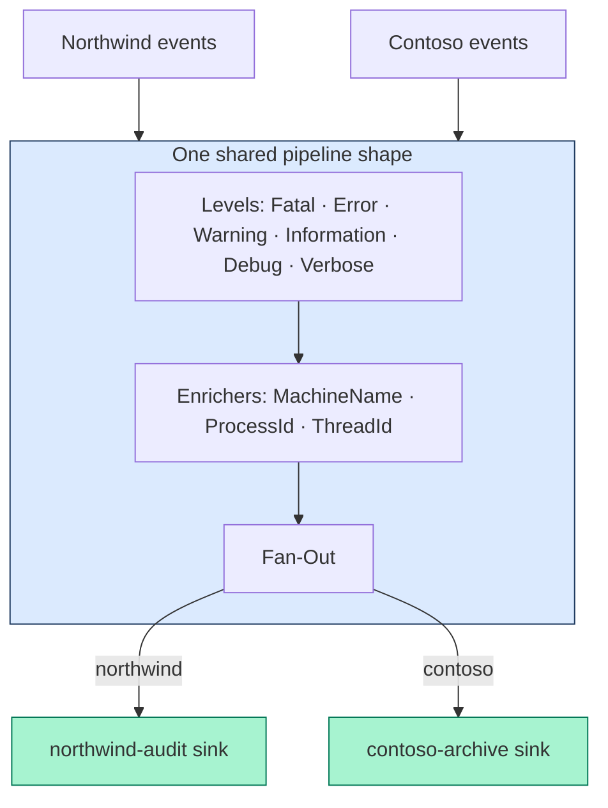

# Herald.Pro User Guide — Two Companies on One Pipeline

Herald.Pro runs more than one company through a single logging pipeline. Each
company keeps its own destinations. Each company's events stay in its own lane.
This guide walks the whole experience: install, license, the two seeded
companies, the admin controls, and the per-company live feed.

This is the Pro-tier version of the Herald.OSS demo. The OSS demo shows one
company logging to one pipeline. Pro shows two companies on one shared pipeline,
each isolated from the other. The shape scales past two. Two is what the demo
ships so you can see the isolation with your own eyes.

Every step below is backed by a passing test or a recorded browser walk. Where a
claim has evidence, this guide names it. If a step has no evidence yet, the guide
says so. It does not pretend.

> 💡 **Quick picture.** Think of an office building with one mailroom. Every
> tenant's mail goes through the same sorting line, but each tenant has their own
> locked mailbox. The sorting line is shared. The mailbox is private. Herald.Pro
> is that building. One pipeline does the sorting, and each company's events land
> only in that company's own boxes.

---

## 1. Install and run

Herald.Pro ships as a global .NET tool. Install it, run it, open the page it
prints.

```bash
dotnet tool install --global Herald.Pro
herald-pro
```

`herald-pro` needs a .NET 8 (or newer) runtime with the ASP.NET Core shared
framework. If you build .NET web apps, you already have it.

When it starts, the tool prints a banner. The banner gives you two things: the URL
to open and a demo license token to paste.

```
Herald DemoApp is running.
Open http://localhost:5216/pro/Pro%20Admin.html in your browser.

Demo license — paste this into the license gate to begin:

hl2.eyJzdWIiOiJoZXJhbGQtZGVtby...

Press Ctrl+C to stop.
```

The tool picks the first free port in the range 5210–5230. To pin a port, pass
`--port`:

```bash
herald-pro --port 5218
```

> **Evidence.** The launch path and banner are exercised by the re-walk's
> freshness protocol, which runs `herald-pro` on a fixed port and reads the token
> off the banner before the browser session starts
> (`E:/dev/Herald/e2e-pro/rewalk3.spec.js`, header comment + `DEMO_TOKEN`). The
> banner output itself is captured in `E:/dev/Herald/e2e-pro/demoapp-5218.log`.

> **Note on the install command.** The package id is `Herald.Pro` and the command
> is `herald-pro`. Both are set in the tool's project file
> (`samples/ProApp/ProApp.csproj`: `PackageId`, `ToolCommandName`). The package
> version published to nuget.org is set during the Pro publish wave; confirm the
> exact pinned version with that wave before you treat the `dotnet tool install`
> line as final. Until the package is on nuget.org, run the same experience from
> the source tree with the demo launch:
> ```bash
> dotnet run --project samples/ProApp -- --port 5218 --spa "…/Live Viewer"
> ```

---

## 2. The license gate

Herald.Pro starts **locked**. The Pro features (multiple companies, per-company
isolation) stay off until you activate a license. This is the model where the
customer provides their own license to turn the product on.

When the tool boots, only its own demo tenant is live. The two Pro companies are
held back. The console shows this plainly:

```
warn: Tenant 'northwind' was not admitted (license does not grant multi-tenant); skipping its pipeline.
warn: Tenant 'contoso' was not admitted (license does not grant multi-tenant); skipping its pipeline.
```

Open the Pro Admin page. You land on the gate: a single field that says paste your
demo license to begin. Paste the token from the banner and press **Start**. The
admin shell unlocks and the two companies come live.

Here is the flow from boot to unlocked:

```mermaid
sequenceDiagram
    participant U as Operator
    participant SPA as Pro Admin SPA
    participant Srv as Herald.Pro server
    participant GP as Tenant admission gate

    Note over Srv,GP: Boot — WAITING. Only the demo tenant is live.<br/>Northwind + Contoso are held back.
    U->>SPA: Open Pro Admin page
    SPA->>Srv: GET /api/system/edition-capabilities
    Srv-->>SPA: edition = Community, paidSurfacesAvailable = false
    SPA-->>U: Show the license gate (locked)
    U->>SPA: Paste demo token, press Start
    SPA->>Srv: POST /api/system/license/activate { token }
    Srv->>Srv: Verify the token's signature
    Srv->>GP: Seed the multi-tenant grant
    Srv-->>SPA: 200 — edition = pro
    SPA->>Srv: GET /api/system/edition-capabilities
    Srv-->>SPA: edition = Pro, paidSurfacesAvailable = true
    SPA-->>U: Unlock the admin shell; both companies live
```

A token that fails verification does **not** unlock anything. An empty submission
leaves the server waiting. A malformed token returns a clean error, not a crash.
The gate is the real boundary, not a cosmetic screen.

> **Evidence.**
> - *Boots locked:* `Server_boots_waiting_so_non_default_tenant_is_locked` and
>   `Edition_capabilities_reports_Community_before_activation`
>   (`LicenseActivationEndpointTests.cs`).
> - *Valid token unlocks:* `Activate_with_multi_tenant_token_unlocks_tenancy`
>   and `Activate_flips_edition_capabilities_to_Pro_and_survives_a_reload`
>   (same file). The served-Kestrel version is
>   `D1_Served_activate_flips_edition_capabilities_to_Pro_and_stays_Pro_on_reload`
>   (`ProServedPathWave3Tests.cs`).
> - *Bad input stays locked:* `Activate_with_invalid_token_stays_locked`,
>   `Activate_with_absent_token_stays_locked`, and
>   `Activate_with_empty_kid_map_returns_clean_400_not_500` (same file).
> - *Browser:* the gate and the post-activation shell are captured at
>   `rewalk3-d4-gate.png` and `rewalk3-d4-post-activation.png`; the SPINE test
>   confirms the page renders the gate or the unlocked shell and never a blank or
>   error page.

---

## 3. Two companies on one pipeline

Once you activate, two companies come live:

| Company | Tenant id | Its own sink |
|---|---|---|
| Northwind Trading | `northwind` | `northwind-audit` |
| Contoso Finance | `contoso` | `contoso-archive` |

Both companies run through **one shared pipeline**. The shared part is the
pipeline shape: the same six log levels, the same enricher chain, the same fan-out.
The private part is the destination. Northwind writes to its audit sink, and Contoso
writes to its archive sink.



This is the design choice the tests protect. It is **one pipeline with two
leaves**. The level set, the enricher chain, the minimum level, and the logger
chain are byte-identical across both companies. Only the named sink differs. That
keeps the shared cost shared. You maintain one pipeline shape, not one per company.

> The "one shape, two leaves" decision removes the duplication you would get if
> each company carried its own full pipeline definition. The companies differ by
> one field, the sink name, so the difference lives in that one field. There are no
> parallel copies of the whole pipeline to keep in sync. That is a DRY win baked
> into the shape.

> **Evidence.** `M2_2_BothTenants_ShareOnePipelineTopology_DifferOnlyBySink`
> (`MultiTenantIsolationTests.cs`) asserts the levels, enrichers, minimum level,
> and logger chain are identical across both companies and that only the sink leaf
> differs. The seeded names and sink ids are set in
> `samples/.../Demo/DemoOptions.cs` (`Northwind Trading` / `northwind-audit`,
> `Contoso Finance` / `contoso-archive`) and the shared shape is built in
> `TwoTenantLiveSource.SharedBootstrapWithNamedSink`. The two-company dashboard is
> captured at `rewalk3-d2-admin-after.png`.

> **Evidence (they only come live with the grant).** A waiting server admits only
> the demo tenant; the two companies are held back
> (`WaitingServer_RejectsAdditionalTenants_OnlySeedComesUp`). Activating a
> multi-tenant token brings both companies up over the shared bootstrap
> (`ActivatedMultiTenantToken_UnlocksAdditionalTenants`,
> `MultiTenantAdmissionTests.cs`).

---

## 4. Admin control

The Pro Admin page is where you run the companies. Each company has a row. Each row
shows the company's health, its sinks, and its controls.

From a company's row you can:

- **Open Viewer** opens that company's live log feed in a new tab (covered in
  section 7).
- **Edit** opens the company's pipeline editor so you can change its sinks and save.

### Editing a company's sinks

Click **Edit** on a company. The editor opens, seeded with that company's current
configuration, the real sink objects rather than placeholder strings. Change what
you need. Click **Save**. The pipeline republishes and the company's sinks survive
the save. They are not wiped, and the company's display name does not change.

> 💡 **Quick picture.** Editing a company is like updating one tenant's mailbox
> label without touching the sorting line or anyone else's box. You change the one
> thing you opened; everything else stays where it was.

> **Evidence.**
> - *The editor seeds from real sink objects, and sinks survive the save:*
>   `D3 — sink edit round-trip; sinks remain after publish (no wipe)`
>   (`rewalk3.spec.js`). It records Northwind's sinks before the edit, confirms the
>   seed data is full objects (not bare strings), saves, and confirms the sinks are
>   still present after the publish.
> - *The editor's seed endpoint resolves correctly:*
>   `D3_Served_editable_config_GET_resolves_200_not_405`
>   (`ProServedPathWave3Tests.cs`). `GET .../sinks/editable-config` returns its own
>   data and is not shadowed by another route.
> - *The display name does not change on save:*
>   `D5 — pipeline display name unchanged after save (no rename)`
>   (`rewalk3.spec.js`).
> - *Browser:* `rewalk3-d3-before-edit.png`, `rewalk3-d3-editor-open.png`,
>   `rewalk3-d3-after-save.png`, `rewalk3-d5-after-save.png`.

---

## 5. Isolation — one company never disturbs the other

This is the guarantee that makes multi-tenant logging trustworthy: **a company's
events land only in that company's sinks, and one company's changes never touch
another's.**

Isolation holds in five situations, and each one has a test:

1. **Routing.** Northwind's events land only in `northwind-audit`. Contoso's land
   only in `contoso-archive`. Nothing crosses.
2. **Shared shape, separate destinations.** Both run one pipeline shape and differ
   only by the sink, proven structurally rather than by hope.
3. **Editing one leaves the other alone.** Rebuild Northwind's pipeline and
   Contoso keeps flowing into its own sink, unchanged.
4. **Editing under load stays clean.** Even while Contoso is mid-stream under heavy
   traffic, a Northwind reload drops nothing and crosses nothing.
5. **Deleting one leaves the other running.** Tear down Northwind and Contoso keeps
   working; a stray event for the gone company is dropped, never rerouted.

> 💡 **Quick picture.** Back to the mailroom. If you replace one tenant's mailbox,
> the others keep getting their mail. If you remove a tenant entirely, the rest of
> the building doesn't notice. And a letter addressed to the departed tenant gets
> returned. It never gets stuffed into someone else's box.

> **Evidence.** The five situations map one-to-one to Echo's isolation chapter in
> `MultiTenantIsolationTests.cs`:
> - M2.1 `..._LandOnlyInOwnSink_NeverCrossRoute` — routing, stated both positively
>   and negatively (nothing of A's reaches B's sink).
> - M2.2 `..._ShareOnePipelineTopology_DifferOnlyBySink` — shared shape.
> - M2.3 `..._MutatingTenantAConfig_LeavesTenantBOperational` — edit isolation.
> - M2.4 `..._ConcurrentReloadOfA_WhileBDispatches_StaysIsolated` — 200 events
>   through B with no drop and no cross-route while A reloads five times.
> - M2.5 `..._DeletingTenantA_LeavesTenantBOperational` — delete isolation.
> - *Browser:* the walk records Contoso before and after a Northwind edit and
>   confirms Contoso is untouched:
>   `SPINE — Contoso isolation: Northwind edit does not disturb Contoso`
>   (`rewalk3.spec.js`); screenshots `rewalk3-spine-contoso-before.png` and
>   `rewalk3-spine-contoso-after.png`.

---

## 6. Demo mode and the DEMO watermark

The tool runs in demo mode. Demo mode self-mints the license you paste. No
production key ships with the tool. To keep the demo honest, **every event is
marked DEMO** so no one mistakes demo output for a licensed deployment.

The watermark shows up in three places:

- A demo banner across the top of the admin page.
- A demo badge on each company.
- A per-event **DEMO** pill in the live feed, on every event.

When demo mode is off, none of these appear. The watermark is demo-only by design.

> **Evidence.**
> - *Every event carries the watermark, both companies:*
>   `DemoMode_TagsEveryEvent_BothTenants_WithIssuedDemoWatermark`, and the negative
>   `NonDemoMode_TagsNoEvent` (`MultiTenantIsolationTests.cs`).
> - *The banner / badge renders after activation:*
>   `SPINE — DEMO banner/badge renders post-activation` (`rewalk3.spec.js`);
>   screenshot `rewalk3-spine-demo-badges.png`.
> - *The per-event DEMO pill renders in the live feed:*
>   `NEW — per-event DEMO watermark (.lvl-demo) renders in live feed`
>   (`rewalk3.spec.js`) injects a demo-marked event and confirms the DEMO pill
>   appears; screenshots `rewalk3-watermark-viewer-loaded.png` and
>   `rewalk3-watermark-after-inject.png`.

---

## 7. The per-company Live Viewer

Each company has its own live feed. From a company's row in the admin page, click
**Open Viewer**. The company's Live Viewer opens in a new tab, scoped to that
company's pipeline, and its events render in the feed.

The viewer opens with the company's own log levels already loaded: the canonical
six (Fatal, Error, Warning, Information, Debug, Verbose). The feed fills with the
company's recent events and then streams new ones as they arrive.

> **Evidence.**
> - *The viewer opens scoped to the company and renders events:*
>   `D2 — viewer URL uses pipeline ID; hydration 200; events render in feed`
>   (`rewalk3.spec.js`). It confirms the viewer URL carries `tenant=northwind`, the
>   pipeline id (not the display name), the page is not a 500, and the level UI
>   loads. Screenshots `rewalk3-d2-viewer.png` and
>   `rewalk3-d2-viewer-with-events.png`.
> - *Each company's levels hydrate 200 with the canonical six, before and after
>   activation:* `D2b_Served_nonseed_Pro_tenant_levels_return_200_with_canonical_set`
>   and `D2b_Served_nonseed_Pro_tenant_levels_stay_200_after_activation`
>   (`ProServedPathWave3Tests.cs`).

---

## 8. Reload survival

Activation holds for the life of the running tool. Refresh the admin page and you
stay unlocked. The gate does not come back, the edition stays Pro, and the
companies stay live. You activate once per run, not once per page load.

> **Evidence.**
> - *Reload stays unlocked:* `D1 — reload survives; Pro admin stays unlocked;
>   edition stays Pro` (`rewalk3.spec.js`) reloads the page and asserts the gate
>   does not reappear, the shell stays up, the edition reads Pro, and the tenant
>   rows are still present. Screenshots `rewalk3-d1-pre-reload.png`,
>   `rewalk3-d1-post-reload.png`, `rewalk3-d1-final.png`.
> - *Same guarantee over the served Kestrel path:* the second and third
>   edition-capabilities probes both read Pro in
>   `D1_Served_activate_flips_edition_capabilities_to_Pro_and_stays_Pro_on_reload`
>   (`ProServedPathWave3Tests.cs`).

---

## What this guide does not cover

This guide documents the operator surface: install, the license gate, the admin
page, the company controls, the live feed, and the isolation guarantee. It does not
cover how the engine admits tenants, how the license verifies, or how events route
internally. Those are implementation details that live behind the surface. You
operate the surface, not the engine.

For the open-source single-company experience, see the Herald.OSS quickstart.
