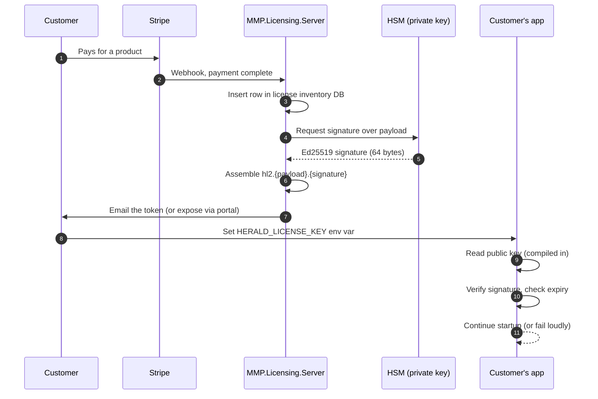
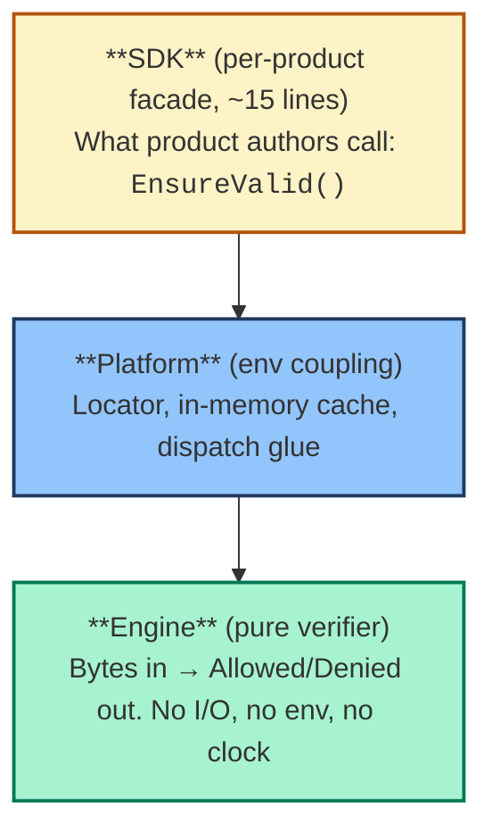

# How MMP.Licensing works, a grounding for newcomers

This page is for someone who has never built or run a licensing
system before. By the end, you should know what a license token
is, how it reaches a customer's app, how the app verifies it
without phoning home, and why the system is shaped the way it
is. The companion page,
[how MMP.Licensing defends against attacks](./how-licensing-defends.md),
covers the security side.

Two ideas run through everything below. First, a license token
is a small piece of signed data, not a magic key. Second, the
system exists to help honest customers stay honest. Most of the
design catches ordinary mistakes. Typos in environment
variables. Clocks a few seconds off. Test tokens that slip into
production. We also defend against attackers, but that bucket is
much smaller. We'll cover the bigger one first because it's the
work the system does every day.

## What a license token is

A license token is a short string of text that proves a customer
paid for a product, at a tier, until a date. It looks like this:

```
hl2.eyJzdWIiOiJjdXNfUHFYa00yIiwicHJkIjoiaGVyYWxkLXBybyIsImVkIj...etc.AbCdEf123...
```

Three pieces, separated by dots:

- **The prefix** (`hl2.`) tells the verifier what version of the
  format follows. Today, version 2.
- **The payload** is a JSON object holding the customer's facts
  (who they are, what they bought, when it expires), encoded in
  a URL-safe form of base64.
- **The signature** is 64 bytes of cryptographic proof, also
  base64-encoded. The signature is what stops anyone without the
  private signing key from forging a token.

Inside the payload are short fields like `sub` (customer ID),
`prd` (product), `ed` (edition), `iat` (issued at), `exp`
(expires), and `kid` (which signing key was used). The names are
short on purpose. We want the whole token to fit in one
environment variable or HTTP header.

The full schema lives in
[the wire-format spec](../../../../MMP.Licensing/doc/token-format-v2.md).
For this page, the three things to hold onto are: small string,
signed, self-contained.

## What "signed" means, in plain words

Signing is a cryptographic trick. It lets a customer's app answer
one question with confidence: was this token issued by us, and
has anyone tampered with it since?

The trick uses two keys that are mathematically paired. They get
generated together, and only the matching pair works.

- The **private key** lives on the license server. It produces
  signatures. We guard it carefully. It sits inside **Azure Key
  Vault Premium**, an HSM-backed key store certified to **FIPS
  140-2 Level 2**, never on an engineer's laptop.
- The **public key** is harmless to share. It can *check* a
  signature but can't produce one. We embed the public key
  inside every product we ship.

When a customer's app starts up, it takes the token, runs the
math with the embedded public key, and gets back a yes-or-no
answer. Yes means the token is authentic. No means either the
token was forged or someone changed a byte after the fact.

> **Quick picture.** Think of a hotel keycard. The office has a
> special programmer that writes the magnetic stripe, and only
> the office has it. Every door reader in the hotel can *check*
> whether a stripe was written by that programmer. No door
> reader can write a new stripe. That's the private-key
> versus public-key split. The license server has the
> programmer. Every shipped product has a reader.

We use a signing algorithm called **Ed25519**. It's modern. It
produces a fixed 64-byte signature. The verifier needs no
internet access to run the math. It needs the public key (which
is already in the product) and the token (which the customer
provided).

That "no network call needed to verify" property is what makes
the rest of the design possible. A customer can run our product
in a fully air-gapped environment, and the licensing system
still works.

## How a token travels from us to the running app

Here's the round trip, from purchase to a running verifier.



A few things worth pointing out:

- **The license inventory DB** is a small Azure SQL database that
  remembers every token we've ever issued. A customer might end
  up with 25 licenses, maybe one per service, or one per
  developer, or one per region. The DB tracks them so neither
  side has to remember. For the deployment shape (which database,
  which cloud region, what it costs us per month), see
  [where the license server runs](./where-the-license-server-runs.md).
- **The HSM** is **Azure Key Vault Premium**, FIPS 140-2 Level 2
  certified hardware whose only job is to hold the private key
  and produce signatures on request. We send it the payload
  bytes. It sends back the signature. The private key itself
  never leaves the HSM boundary. No employee has direct access to
  the key. If our server is compromised, the attacker still can't
  extract the private key.
- **The customer's app reads the public key from inside its own
  compiled binary.** The public key is not a separate file the
  customer has to manage. It got compiled in when we built the
  product.

The signing step happens once, at issuance. After that, the
token is a static string. The customer can copy it, paste it,
move it between environments. Every verification after that runs
locally as a math operation.

## How the customer's app finds the token

The verifier doesn't go looking on the internet for a license.
It looks in two places on the local machine, in order, and uses
the first one it finds.

1. **An environment variable** named `HERALD_LICENSE_KEY` holding
   the token directly.
2. **A file** at a known path. Either the path in
   `HERALD_LICENSE_FILE`, or a default OS-specific location like
   `/etc/herald/license.key` on Linux or
   `%PROGRAMDATA%\Herald\license.key` on Windows.

A future version will add an optional hook for cloud key vaults
like Azure Key Vault or AWS Secrets Manager, for customers who
already manage secrets that way. The verifier doesn't care
*which* source produced the bytes. It gets a string and goes to
work.

This part of the system has its own name: the **locator**. It's
small and dumb on purpose. Its only job is to read bytes from a
source. It doesn't verify. It doesn't parse. It doesn't
validate. That keeps the failure modes well-separated. "No token
found" is a different error from "token signature invalid", and
the messages the customer sees stay specific to what actually
happened.

> **Quick picture.** The locator is like the coin slot on a
> parking meter. The slot's job is to accept a coin. It doesn't
> decide if the coin is real, or how much time you bought. A
> separate mechanism inside the meter handles that. Splitting
> the two means the slot can be tested on its own, and the
> validator can be swapped without touching the slot.

That separation is one example of CUPID's *Unix philosophy*.
Small, focused pieces that each do one thing well, and compose
into the bigger behavior.

## The three layers: engine, platform, SDK

The licensing code is split into three layers that build on each
other:



Reading from the bottom up:

- **The engine** is the pure verifier. You hand it the token
  bytes and the kid-map (a lookup of `{key-id →
  public-key-bytes}`), and it hands back a `Result` saying
  "allowed" or "denied" with a reason. It does no I/O. It never
  reads an environment variable. It never asks for the current
  time. The clock is passed in as a parameter. That keeps it
  fully testable. Every edge case becomes a unit test that runs
  in milliseconds.
- **The platform** is the glue between the engine and the world
  it runs in. It owns the locator, an in-memory cache (so we
  don't re-verify on every call), and the dispatch logic that
  decides what to do with the engine's result.
- **The SDK** is a thin per-product facade. Each product gets
  about 15 lines of code that wire the platform together with
  that product's expected kid-map and product name. From the
  product author's point of view, calling licensing is one line:
  `await Licensing.EnsureValidAsync()`. The same shape exists
  for `Herald.Pro`, `Herald.Enterprise`, `Herald.TesseraSeal`,
  and the Python aggregator.

The shape avoids a classic DRY trap. Without the engine/platform
split, every product would have to reimplement signature
verification, expiry checking, kid-map lookup, and the rest of
it. With the split, those facts live in *one place* (the
engine), and every product gets them by construction. Two
products can't disagree on what "expired" means, because only
one expiry check exists.

The layout is also CUPID-shaped. The engine is **Composable** (a
pure function with no hidden state). The platform is
**Predictable** (the same env produces the same locator
outcome). The SDK is **Domain-based** (the API speaks the
product's language: "ensure this is a valid Herald.Pro license").

## Why we have more than one signing key: the kid map

We rotate the signing key once a year. Every January, we
generate a fresh keypair, give it a new identifier (a `kid`,
short for "key id"), and start signing new tokens with it. Old
tokens already in the wild keep working. They were signed with
last year's key, and the verifier still holds last year's public
key.

A `kid` looks like `2026-1`. Year and rotation number. The
verifier carries a small dictionary mapping each `kid` to the
matching public key:

```json
{
  "2025-1": { "alg": "ed25519", "pub": "...base64..." },
  "2026-1": { "alg": "ed25519", "pub": "...base64..." }
}
```

When a token arrives, the verifier reads the `kid` from the
payload, looks up the matching public key, and uses *that* one
to check the signature. A token signed with `2025-1` validates
against the `2025-1` public key. A token signed with `2026-1`
validates against the `2026-1` public key. Same code path, both
keys live side by side. No flag day, no coordinated release.

> **Quick picture.** Imagine your house has a normal lock and a
> deadbolt. Each lock accepts a different key. The doorframe
> doesn't care which key you used, as long as the right lock
> opens. The kid-map is that doorframe. It holds several locks,
> and any token can prove it has the right key for one of them.

That's what makes annual rotation safe. Without the kid-map, the
day we rotate is the day every customer's existing token stops
working. With the kid-map, rotation is silent. New tokens get
the new kid. Old tokens keep validating against the old kid
until they naturally expire.

## What happens when a license expires or gets revoked

Two different events, two different paths.

**Expiry is built into the token.** The payload carries an `exp`
field with the expiration timestamp. The verifier checks it
against the current clock on every verification. When the clock
passes `exp`, the verifier returns `Denied(expired)`. The
product then does whatever it was designed to do for an expired
license, usually a clear startup error with a link to renew.

**Revocation is something we do on our side after issuance.** If
a customer charges back, switches plans, or we discover their
token was compromised, we mark the row in our inventory DB as
revoked. For products that opt into online revocation checks,
the verifier calls a small endpoint on the license server during
startup and asks "is this token still good?". The endpoint
returns one of three answers:

- `Allowed`. The token is fine. Continue.
- `Revoked`. We revoked it. Stop.
- `SourceUnavailable`. We couldn't reach the server. The product
  picks a policy. Fail closed (stop) or fail open (continue and
  retry later). Most customers pick fail-open with a grace
  period, so a network blip doesn't take their service down.

Products that don't opt in get a `NullRevocationChecker` that
always returns `Allowed`. The check is structurally present so
products can opt in later without an API break. But if no one
opts in, no network call is ever made, and the default stays
fully offline.

## Why we embed the source instead of shipping a NuGet package

This is the design choice most likely to surprise a developer
who's used licensing libraries before. The usual pattern is to
publish a library to NuGet (or PyPI), have every product depend
on it, and ship version updates as a normal package release.

We don't do that. Each product **embeds the licensing source
code** as a git submodule pinned to a specific commit. The .NET
project file pulls in the source files with a
`<Compile Include="...">` glob. The Python project lays the
source down inside its own package. Every product **compiles its
own copy** of the licensing code into its own binary.

> **Quick picture.** A hotel chain doesn't share one master
> keycard reader across all its hotels. Every hotel has its own
> reader, programmed on its own. If one reader gets compromised
> (say a maintenance worker copies the model number), the chain
> doesn't have to retool every hotel. They reprogram the
> affected reader. The shared-library version of this would be
> one giant reader in a warehouse that every hotel phoned home
> to consult, and one outage would take the whole chain down.
> We don't want a giant reader.

Three reasons drive this:

1. **An attacker can't swap a single shared DLL.** If the
   verifier shipped as `MMP.Licensing.dll`, an attacker could
   replace that one file with a stub that always returns
   "allowed", and every Herald product on the machine would
   accept any token. Because each product compiles its own
   copy, the attacker has to forge each product separately. And
   modifying a compiled assembly is loud, traceable, and breaks
   the product's normal signing.
2. **Version drift is explicit.** A product pins a specific
   submodule SHA. Upgrading licensing is a deliberate commit
   that updates the pointer. There's no "implicit upgrade when
   the customer runs nuget restore". The source code in each
   product stays fixed until someone bumps the pin.
3. **Cross-language parity is enforced by structure.** The same
   `src/engine/dotnet/`, `src/engine/python/`, `src/engine/go/`
   tree means every language verifier reads from the same
   conceptual engine. A cross-language test harness runs the
   same test vectors against every implementation. Drift
   between languages becomes a CI failure, not a customer
   support ticket.

The tradeoff is that bumping the licensing version requires a
product release. We accept that. Licensing isn't a feature
library. It's a security boundary, and slow, deliberate updates
are the right cadence for one of those.

## What we deliberately did not build

A short list of things people often expect to find in a
licensing system and won't find here.

- **No client-side license server.** The token itself carries
  everything the verifier needs. No background process, no
  daemon, no port to open.
- **No phone-home on every event.** The verifier checks the
  signature once at startup, caches the result, and re-checks
  only when its cache expires (typically hours). The product's
  hot path never touches licensing.
- **No DRM-style code obfuscation.** We don't obfuscate the
  product binary. The protection is cryptographic, not based on
  making the code hard to read. We trust the math, not the
  difficulty of reverse engineering.
- **No grace-period gimmicks.** An expired token is expired. The
  product fails clearly, points to renewal, and stops. A clear
  error beats a service that quietly degrades.

## Where to go next

For the security and abuse-resistance story, read
[how MMP.Licensing defends against attacks](./how-licensing-defends.md).
It picks up where this page leaves off, with the honest-mistake
defenses and the adversarial defenses laid out side by side.

For the engineering rationale (the trade-offs we considered, the
alternatives we rejected, the design decisions recorded with
their reasons), read
[ADR-0001](../../../../MMP.Licensing/docs/adr/0001-mmp-licensing-architecture.md)
in the MMP.Licensing repository.

For the byte-level wire format (exact field names, allowed
values, signature conventions), read
[the token-format-v2 spec](../../../../MMP.Licensing/doc/token-format-v2.md).
