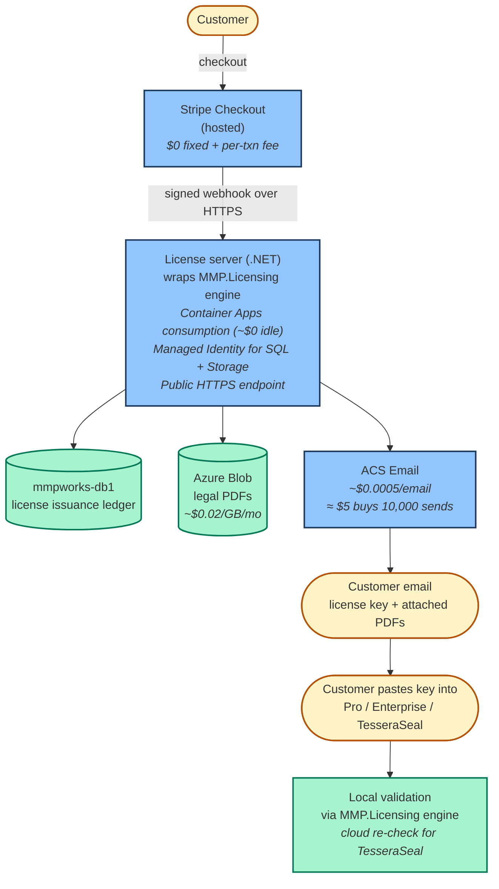

# Where the license server runs, end to end

The companion page,
[how MMP.Licensing works](./how-licensing-works.md), explains
*what* a license token is and *how* it gets verified inside a
customer's app. This page picks up the other half. It shows
*where* that server actually runs, what it talks to, and what
every box costs us in real cash each month.

The shape is small on purpose. Most of it runs at zero dollars
when nobody is buying. The pieces that always cost money are
named, with the price written out. Nothing is hidden behind
"contact us for pricing" because nothing here is mysterious.
It's a small .NET app, a database, a blob store, and an email
sender, glued together by signed webhooks.

## The end-to-end picture

Here is the flow, from the customer clicking *Buy* to the
customer's running app verifying its new key.

If you prefer the original sketch, the ASCII version is preserved
at `diagrams/licensing/license-server-end-to-end-flow.ascii.txt`.
The Mermaid source above lives alongside it as
`license-server-end-to-end-flow.mmd`.

## What each box is, and what it costs

Walking the diagram top to bottom.

### Stripe Checkout (hosted)

Stripe hosts the entire payment page. The customer never lands
on our server during the transaction. They click *Buy* on the
marketing site, get redirected to Stripe, fill in their card
details on Stripe's domain, and get redirected back to us when
the payment clears.

**Cost:** no fixed monthly fee. Stripe takes a per-transaction
cut. For a $79 Pro Team license, Stripe's standard 2.9% + $0.30
fee is about $2.59 per sale. That's real money per transaction,
but there is no "Stripe is on" bill arriving even when no one
buys.

> **Quick picture.** Think of Stripe Checkout like the card
> terminal at a coffee shop. The shop doesn't run the network,
> doesn't write the firmware, doesn't carry PCI compliance for
> the terminal itself. They plug it in and accept payments. We
> plug Stripe in. They handle the regulated bits.

That separation is one example of CUPID's *Unix philosophy*.
Stripe does one thing well: take a payment, prove it happened,
tell us about it. We never write the card-handling code.

### The license server (.NET on Container Apps)

This is the only piece of compute we own. It is a small ASP.NET
app that does three things in response to a Stripe webhook:

1. Verifies the webhook signature using the Stripe signing
   secret.
2. Mints a license key by calling into the **MMP.Licensing
   engine** (the same code that runs inside the customer's app
   later to verify the key — see
   [how MMP.Licensing works](./how-licensing-works.md) for the
   engine layout).
3. Writes the issuance to the database, fetches the matching
   legal PDFs from blob storage, and hands the bundle to the
   email sender.

The server runs on **Azure Container Apps, consumption tier**.
That means it scales to zero when nobody is buying. When a
webhook arrives, Container Apps spins up a replica, runs the
work, and scales back down. The bill matches the work.

**Cost:** the Container Apps environment itself is $0 per month
when nothing is running. The free monthly grant covers
180,000 vCPU-seconds and 360,000 GB-seconds — far more than a
bootstrap-volume license server uses. Expect $0 to $2 per month
on the compute line until volume actually arrives. The container
registry (`mmpworksacr`, Basic tier) is a flat $5 per month and
is the only piece of always-on cost.

The server authenticates to the database and to blob storage
using **Managed Identity**. There is no SQL password on disk, no
storage connection string in an environment variable, no secrets
in the container image. The identity is Azure-issued, scoped to
the resources the server actually needs, and rotated by the
platform.

> **Quick picture.** Managed Identity is like a hotel staff
> keycard that only opens the rooms that staff member is
> supposed to clean. Lose the card and only those rooms are at
> risk. Hand the card to a new hire on Monday and they have
> exactly the same access on Tuesday. We never have to copy a
> master key around.

That keeps a whole class of leak out of reach. Even if our
container image leaked to the public registry by accident,
nothing inside it would let anyone connect to the database.

### mmpworks-db1 (Azure SQL issuance ledger)

Every license we ever issue gets a row in `mmpworks-db1`. The
schema is simple: customer, SKU, license key, issued-at,
expires-at, Stripe event id (unique). The unique constraint on
the Stripe event id is what makes the server safe to retry —
Stripe re-delivers webhooks when our endpoint times out, and
the constraint guarantees we only issue one license per
purchase, no matter how many times the webhook arrives.

**Cost:** the DB is on the **Azure SQL free-tier serverless**
SKU today. That means $0 per month within the free limit, with
auto-pause after 60 seconds of idle. Cold-resume from auto-pause
takes 30 to 90 seconds, which is fine for our scale today but
will need attention before the first paying customer activation
happens at 3 a.m. (See the
[operator runbook companion](../operator-runbook/14-bootstrapping-the-license-server-on-azure.md)
for the production-gap list.)

The connection identity story matters here. The server's
Managed Identity has a SQL user in this database. That user has
exactly the permissions it needs (read the customer table,
insert into the issuance ledger) and nothing else. A compromise
of the running container does not become a compromise of the
whole DB.

### Azure Blob Storage (legal PDFs)

When we send a license to a customer, the email carries the
license-agreement PDF as an attachment. Those PDFs live in
Azure Blob Storage, organized by SKU.

**Cost:** roughly **$0.02 per GB per month** on the Hot tier.
The PDFs are small (a few hundred KB each), so the whole legal
library fits in well under a gigabyte. Real-world bill is
pennies per month.

> **Quick picture.** Blob storage is the office filing cabinet.
> We pay rent on the cabinet, not per page. The cabinet doesn't
> charge more when we open a drawer.

Each PDF is fetched by the server using the same Managed
Identity that connects to the database. Same security story,
different resource.

### Azure Communication Services Email

The last hop is sending the license + attachments to the
customer. We use **Azure Communication Services (ACS) Email**
with a verified sender on `mmpworks.com`.

**Cost:** roughly **$0.0005 per email**. Five dollars buys
about 10,000 sends. At a small-customer-base bootstrap volume,
the monthly email bill is in the single-digit cents.

That is honestly the entire outbound side. No third-party
email service, no Mailgun, no SendGrid contract. ACS is in the
same subscription, billed through the same invoice, authenticated
with the same identity story.

### The customer's app

The license key arrives in the customer's inbox along with the
legal PDFs. They paste the key into their copy of Pro,
Enterprise, or TesseraSeal. From that moment on, **the cloud
side has no say in whether the customer's app runs**. The local
verifier reads the key, checks the cryptographic signature
against the public key compiled into the binary, and decides.
No phone-home, no network call, no daemon.

The one exception is **TesseraSeal**, which performs an optional
cloud re-check during startup against the same license server.
The check is structurally present so other products can opt in
later without an API break. Today, only TesseraSeal uses it.

## Why this shape, not something heavier

A few design choices are worth naming.

**Webhook-driven, not polling.** The server sits idle until
Stripe sends a webhook. We don't poll Stripe asking "has anyone
bought anything?" That would burn compute time for no reason
and would make scale-to-zero impossible. Webhooks plus
scale-to-zero is what keeps the idle bill near zero.

**Same engine on both sides.** The license-minting code on the
server and the license-verifying code in the customer's app are
the *same library*. The engine is built once, embedded in both
sides, and produces a key on the server that the same code
shape on the client knows how to read. That's DRY at the
security boundary, which is where DRY matters most — two
implementations of "what does a valid token look like" would
guarantee a contract drift between them, and the drift would
land as a customer support ticket.

**Managed Identity end to end.** Every cross-resource call
(server-to-SQL, server-to-blob, ACS-from-server) uses Managed
Identity. No connection string, no API key, no secret to
rotate. That removes a whole class of "we shipped the secret in
a logfile" failure modes.

**Cost numbers in the open.** The "$0.0005 per email" and "~$5
buys 10K sends" numbers are visible in this doc because they
are visible on Microsoft's pricing page. Anyone can verify
them. That matters because it means the whole architecture is
auditable from outside — a customer who asks "what does it
actually cost MMPWorks to deliver my license?" can read this
page and get an honest answer.

## Cost picture (small bootstrap volume)

| Component | Always-on cost | Per-event cost |
|---|---|---|
| Stripe Checkout | $0/mo | ~2.9% + $0.30 per sale |
| Container Apps environment | $0/mo | covered by free grant at bootstrap volume |
| Container App execution | $0/mo idle | $0–2/mo until volume arrives |
| Azure Container Registry (Basic) | ~$5/mo | — |
| Azure SQL (free-tier serverless) | $0/mo within free limit | — |
| Azure Blob Storage (legal PDFs) | pennies/mo | — |
| ACS Email | $0/mo | ~$0.0005 per send |
| **Subtotal** | **~$5/mo** | **per-transaction Stripe fee + ~$0.0005 per delivered email** |

The honest number to plan against is **about $5 to $10 per
month all-in** until volume arrives. The first line item to
move when volume *does* arrive is the SQL tier — see the
operator runbook for the production-gap list and the cost delta
of closing each gap.

## Where to go next

For the conceptual model (what a token is, how the engine
verifies it, how the kid-map handles annual key rotation),
read [how MMP.Licensing works](./how-licensing-works.md).

For the operational side (the four gotchas hit during the
first deployment, what the production-gap list is, what each
gap costs to close), read
[bootstrapping the license server on Azure](../operator-runbook/14-bootstrapping-the-license-server-on-azure.md).
